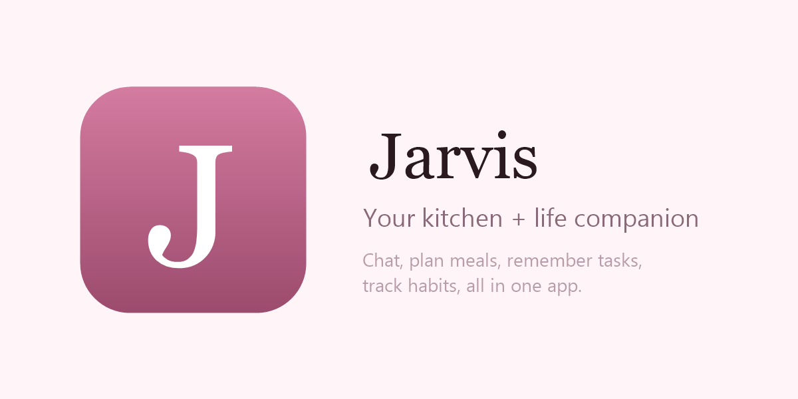
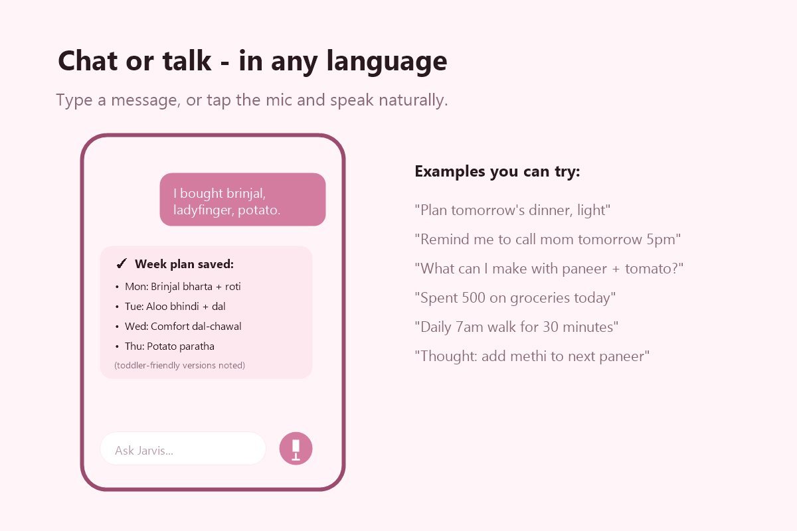
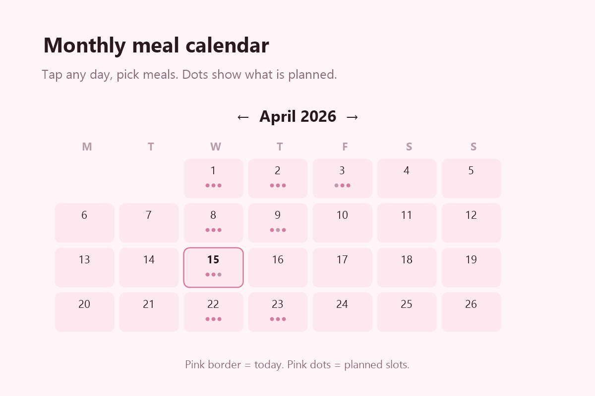
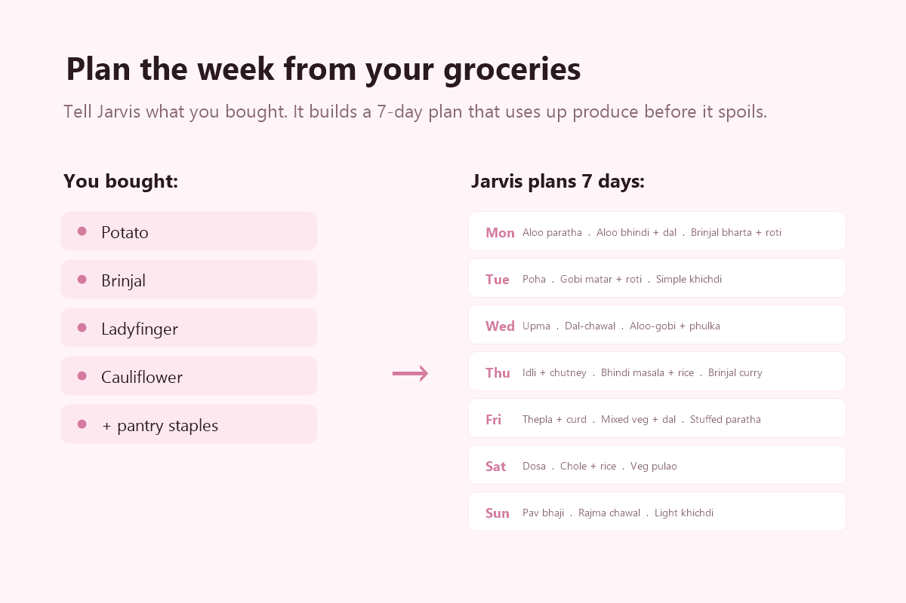
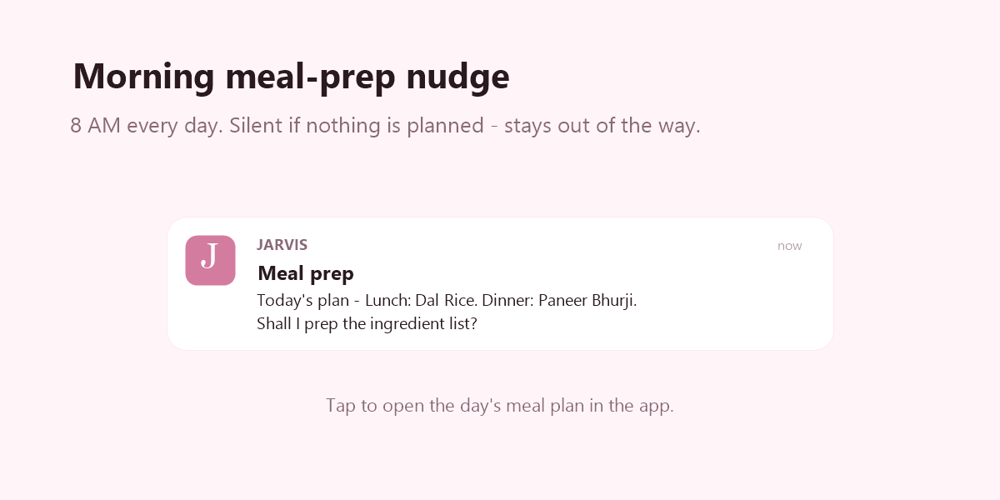
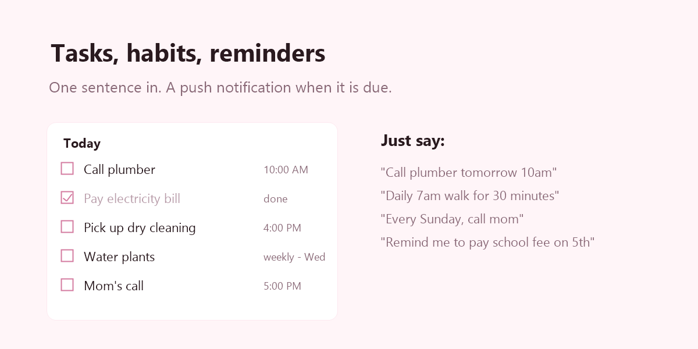
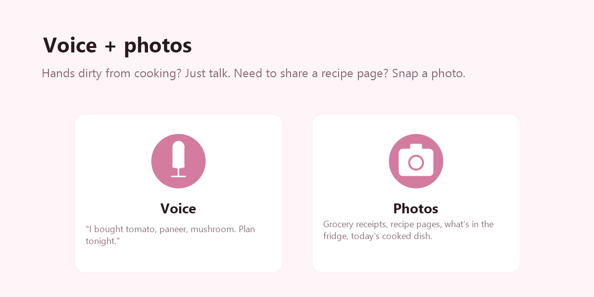
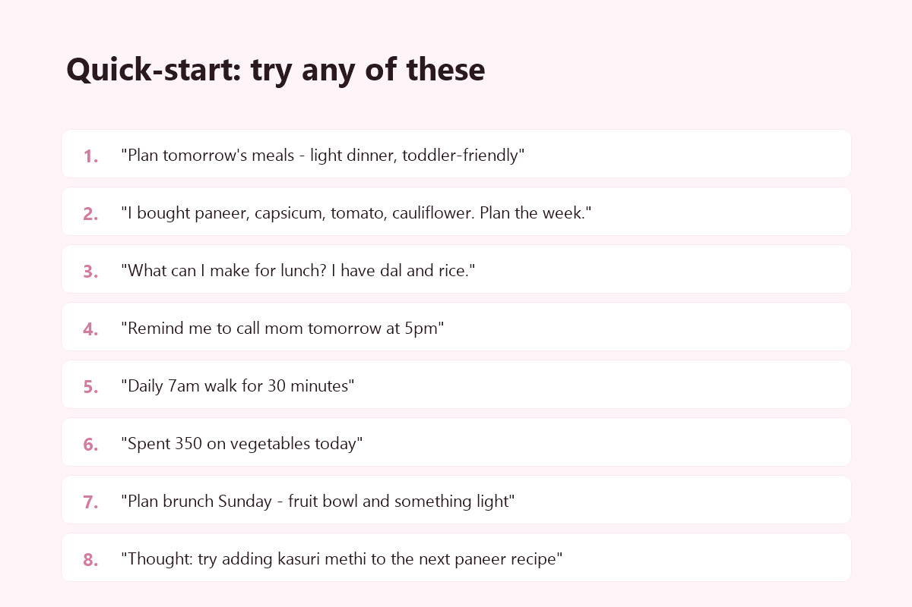

# Jarvis — what it can do for you

Your personal assistant on your phone. Open Safari on iPhone, go to
**jarvis-78573.web.app**, tap **Share → Add to Home Screen**, and it lives
like a real app (no Safari chrome, no URL bar).

Tell it things by typing or by tapping the **mic** and speaking. It
understands Hinglish. Reply with a photo by tapping the camera icon.

---

## 1. Chat with Jarvis — anytime, anything

Type or talk. Ask questions, think out loud, vent, plan.

**Try:**
- "Remind me to call the tailor tomorrow at 5pm"
- "Add haldi, jeera, curd, paneer to my list"
- "I'm feeling a bit off today, what should I cook that's light?"

It'll remember context from earlier in the conversation, so follow-ups work
naturally.

---

## 2. Meal planning — the big one

### Tap-to-plan on the calendar

Open **Meal Plans** tab → tap any day → 5 slots appear:
- **Breakfast** (always shown)
- **Brunch** (optional — tap "+ Add brunch")
- **Lunch** (always shown)
- **Eve Snacks** (optional)
- **Dinner** (always shown)

Pick a dish from the catalog (84 Indian dishes pre-loaded — poha, upma,
dal rice, paneer butter masala, rajma, chole, biryani, dosa, idli,
pav bhaji, pani puri, and many more) or tap **+ New dish** to add
your own family recipe.

Dots on each calendar day show which slots are planned. Today has a
pink border.

### Plan a WHOLE week from your groceries

After shopping, tell Jarvis what you bought:
- "I bought brinjal, ladyfinger, cauliflower, potato. Plan the week."
- "Got paneer, capsicum, tomato. Weekly plan mild for baby."

Jarvis builds a 7-day plan that USES UP those vegetables before they
spoil, mixing them with your pantry staples (dal, rice, atta, ghee, onion,
tomato, spices — assumed by default). Breakfast is usually pantry-only
(poha, upma, paratha); lunch and dinner consume your fresh produce.

### Plan ONE day

"Plan tomorrow's dinner, something light."
"Breakfast tomorrow is poha with chutney, lunch is dal rice."
"What should I cook for Sunday brunch, mild for baby?"

It'll put the meal on the calendar so you can glance at it in the morning.

### Get ideas from what's in your fridge

"I have paneer, onion, tomato. What can I make for dinner in 30 min?"

Jarvis shows 3-4 dish cards with reasoning and missing ingredients. Tap
any card to save it as tonight's dinner.

### Morning nudge

At 8 AM every day, Jarvis sends you a quiet push:
*"Today's plan — Lunch: Dal Rice · Dinner: Paneer Bhurji. Shall I prep
the ingredient list?"*

No nudge on days with no plan — it stays out of the way.

---

## 3. Tasks, habits, reminders

One sentence in. A push notification when it's due.

**Try:**
- "Call the plumber tomorrow 10am"
- "Every Monday 9am, pay maid's weekly"
- "Daily 30-minute walk at 6am"
- "Water plants every Wednesday"
- "Call Amma every Sunday evening"

Tasks show up on the **Tasks** tab; habits on the **Habits** tab.

---

## 4. Thoughts & notes

Anything that's not a task — ideas, recipes you want to try, quotes,
reminders-to-self.

**Try:**
- "Idea: try adding kasuri methi to the next paneer recipe"
- "Remember — anjali's kid is allergic to peanuts"
- "Book to read: When Breath Becomes Air"

Thoughts live on the **Thoughts** tab.

---

## 5. Finance

Track spending + savings.

**Try:**
- "Spent 500 on groceries today"
- "Invested 10,000 in SIP this month"
- "Gave 2000 to driver as bonus"

Finance entries land on the **Finance** tab.

---

## 6. Voice + photos

### Voice

Tap the **mic** anywhere in chat and talk. Jarvis transcribes your voice
automatically and replies back in voice too (if your phone isn't on silent).
Good for when your hands are dirty from cooking.

### Photos

Tap the **camera icon** in chat. Take a photo or pick from gallery.

Useful for:
- Photo of a grocery receipt → "add all the veggies to next week's plan"
- Photo of a recipe from a cookbook → "save this as a new dish"
- Photo of what's in your fridge → "what can I cook with this?"
- Photo of today's cooked dish → "save this as today's lunch"

---

## Your assistant's personality

Jarvis knows you're a **home chef + entrepreneur with a 2-year-old**,
living in India. When it suggests meals it leans toward:
- Indian home-style (North + South + Indo-Chinese)
- Healthy / low-oil variants by default
- Toddler-friendly adaptations (mild spice, soft texture) — just tell it
  if you want to skip this for a particular day
- 20-30 minute weekday prep times
- Seasonal / Ayurvedic cues when you ask ("monsoon ka khana", "something
  warming")

It's warm and Hinglish-comfortable. Say things however is natural — it'll
match your tone.

---

## Things to know

- **First launch on iPhone**: Safari will ask for microphone permission
  (for voice) and notification permission (for reminders). Tap **Allow**
  on both so everything works.
- **Reminders arrive as push notifications** on your phone's lock screen
  even when the app isn't open — once you've added it to home screen and
  granted permission.
- **Long-press the "JARVIS" word** at the top of the app to send yourself
  a test notification and verify push is working.

---

## Quick-start sentences to try

Copy-paste any of these into chat:

1. "Plan tomorrow's meals — light dinner, toddler-friendly"
2. "I bought paneer, capsicum, tomato, and cauliflower. Plan the week."
3. "What can I make for lunch tomorrow? I have dal and rice."
4. "Remind me to call mom tomorrow at 5pm"
5. "Daily 7am walk for 30 min"
6. "Spent 350 on vegetables today"
7. "Thought — try adding a small pinch of jaggery to next tomato curry"
8. "Plan brunch Sunday — fruit bowl and something light"

Have fun. Anything missing or weird — tell Jarvis "bug: X" and it'll
get fixed.
